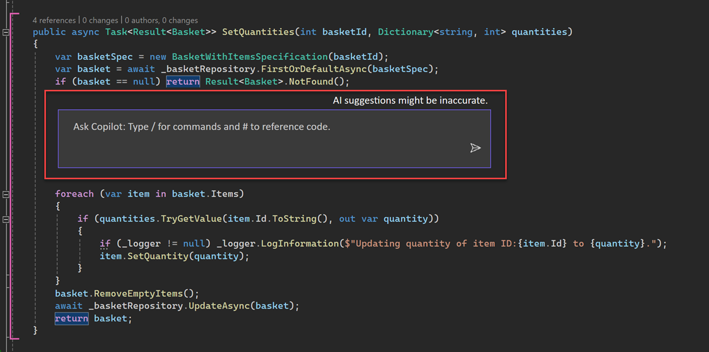
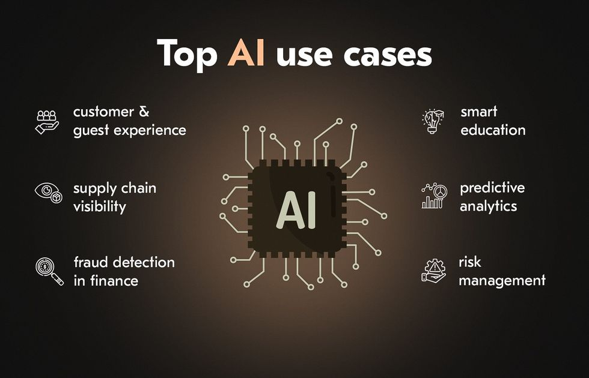

# Introduction
Artificial Intellegence (AI) now floods our everyday lives. It is a central part in many of our devices and we use it both indirectly and directly to accomplish an assortment of tasks. In education, specifically, AI has been a highly debated tool to be allowed in classrooms. While initially barred from many classrooms, there has been a push to allow the use of AI by students. Many proffessors that now allow the use of AI look for originality, as in AI should help to make the voice of the student more clear and effective, not to be the voice for the student. 

In software development, AI plays a big role in fixing, understanding, and developing code. I have had the oppurtunity to work with Chat-GPT as well as Co-Pilot during ICS 314, mostly for the use of fixing errors in my programs. I find the Co-Pilot is particularly useful when working with Virtual Studio as it can make inline edits using code that already exists. In addition, it can create starting prompts for code based on the most used standards, allowing for efficient time use. 

# Personal Experience with AI

### Experience WODs e.g. E18
While I used AI for the beginning WODs (E1-E10) I tried to limit my use for the remaining WODs. In the beginning I mostly used AI to help me understand the content that the WOD was trying to get me to learn. I believe that I needed to really understand the experience WODs and that I was not getting that out of AI so I stopped using AI unless I completely could not understand the WOD. 

### In-class Practice WODs
For the In-class Practice WODs, I did not use AI for these WODs. I believe that most of these WODs were simple enough that I did not need the use of AI to solve the problem. These WODs were also shorter length, so using AI would waste too much time.

### In-class WODs
For the In-class WODs, I did not use AI for the majority of the WODs. This was because I felt that the time it would take to try to get the answer through AI would have taken too long and I would not have been able too complete the WOD within the time limit. The only time that I did use AI was during the functional programming WODs as I has not yet fully understood how to do it. 

### Essays
My use of AI for essays only came in the form of using spell check and grammar usage. I always felt that I had enough content to fill out my essays, so AI was just used to fix spelling and grammar errors. 

### Final project
For the final project, I used Co-Pilot a lot to fix internal errors in the project. A lot of the errors were Prisma errors which Co-Pilot was able to fix. Besides inline editing, I would occasionally use ChatGPT to start coding where I would not know to begin, and Chat-GPT would give me a solution that would work.  

### Learning a concept / tutorial
I would try to limit using AI for learning tutorials and concepts. I believe that the tutorials did a much better job at explaining the intricaies of a language/concept better than the ChatGPT does, so I did not use AI for tutorials.

### Answering a question in class or in Discord
I find that AI can help a lot with answering a question I have in class. I believe that it helps with flow as I do not have to stop instruction for a simple question as well as I can ask more complex questions that can't be solved using AI. 

### Asking or answering a smart-question
I do not use AI that often when trying to answrer a smart-question. I find that if there is not an answer already on stack exchange, then AI does not have a great answer to give. Because of this, I usually try to wait for other's to give their opinion, as they're environments will be much closer to mines. 

### Coding example e.g. “give an example of using Underscore .pluck”
I use AI to give examples of code a lot. Basically most methods that do not have clear docummentation I ask ChatGPT or Co-Pilot for an example of how to use a method. This came in really handy during the functional programming sections. 

### Explaining code
I used AI to explain code a lot during the final essay, when a lot of the elements were borrowed from another template. I found that it was insightful and it connected a lot of the elements that I did not know the purpose of in the code. 

### Writing code
I do not like to use AI to write code. The main reason for this is because I find that AI has a difficult time formatting code in a way that doesn't give errors in ESLint. I find that big chunks of code get a lot of indentation errors, and it takes a lot of unnessecary time in order to fix it. 

### Documenting code
I find that when I document code, I like to be the one to write it out. I find that while AI does a good job in recognizing bits of the code, it does not capture the essence of what I have programmed. 

### Quality assurance e.g. “What’s wrong with this code \<code here>” or “Fix the ESLint errors in \<code here>”
I find that AI does not work for quality assurance. Everytime I use Co-Pilot to fix eslint errors, it just gives the error and solution that it already thrown by the program, but it doesn't fix anything. This makes it terrible to use when trying to make sure that all the code is formatted correctly. 

### Other uses in ICS 314 not listed
AI also does a good job in doing some of the design work for projects. Although I did not use AI for the final project mockups, I certainly did use AI to create some of the catchy titles, or styles used in some of the visual elements. 

# Impact on Learning and Understanding
I believe that the use of AI changed the style of how I learned the material of this course. While I initially did not memorize and anaylize the content as frequently as I normally would, AI helped me digest the content very quickly. I found myself understanding the information and being able to apply it after letting AI explain it to me once. I believe that it was a really good tool that aided my style of learning, and made a lot of the content very easy to understand. One drawback that I do notice about using AI is seeing how code can be used on a wider scale. I believe that making connections on your own helps when applying skills learned to other assignments. When using AI, a lot of the solutions are told for the specific problem, so it doesn't help when you have to apply that skill to other problems. To overcome this, I made sure to only use AI for assisting what I already knew, not to create the idea for me. 

# Practical Applications
AI has a great use in educational research. One of the big things that AI was created for was simulations. AI are able to simulate population growth and predict trends based on changes in the environment. This has had the effect of being able to predict everything from weather patterns, how diseases evolve, and how bacteria colonies grow and spread. AI doesn't just stop there, however. AI has also been used in medical applications in diagnosing evaluating patients. This was especially useful during the Covid-19 pandemic where it was used to detect and prevent the spread of the virus. 

# Challenges and Opportunities
I believe the biggest challange with AI is the accuracy of the information that it gives. There is a lot of times that the information is not clear enough to the AI, and it ends up making the wrong assumptions, giving the wrong answer. This is especially difficult as the AI will assure that everything should work well, but it ends up being the smallest error that leads to the wrong output. It definitely takes a dilligent eye to be able to recognize errors and when the code does not make sense in the given context. 

# Comparative Analysis
I believe that an AI approach to software engineering education is very good to teach students aiming to become software engineers. It teaches a reliance on external resources and careful consideration, something that was not as emphasized before the use of AI. It definitely is a new style of learning, however it encourages students to use resources in order to code faster and more efficiently. There is a sense of skill that seems to be lost, as aspiring programmers will not be able to recite instructions from memory, however, with modern technology, there is not many situations where future programmers will not be allowed to use assistive AI in their work. Students are able to better engage with content that AI is able to break down and make understandable. 

# Future Considerations
AI can definitely be used to develop and understand code at a more efficient rate. There could definitely more integration through the use of learning how to engineer prompts. I think that teaching students how to use AI more effectively is a skill that would be very useful for developers going forward. I do still believe that it is important for students to learn and use coding styles as well as design patterns, as they are the basis behind efficient and working designs in modern design. AI will only continue to get better and "smarter" as time goes on, and much more data is able to be processed through the AI. It will be interesting to see if AI has it's own limitations as it continues to grow. 

# Conclusion
To conclude, AI is undoubtably useful in both everyday life as well as in software engineering. In an educational sense, it has it's uses for students, mainly being it's usefulness in generating and explaining code in a understandable formats. One of it's biggest drawbacks, however, is the time it takes to generate and create prompts for the AI. Often times, the time limit is to tight to consider using AI, and if AI was used, it is often too trivial to be useful. There is definitely more to be learned with AI, and with students reporting their prompts, it can help discover some of the best strategies when using AI. Overall, it is definitely something to develop and it continues to be a good field and skill to teach in software development education. 