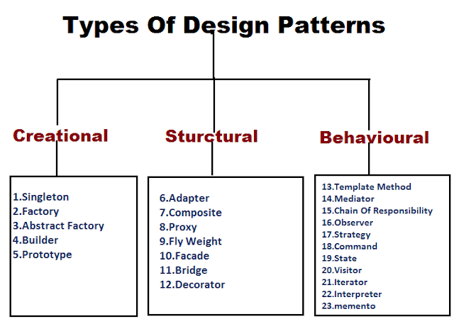

# The Hidden Beauty of Design

# Introduction

In modern society, we rely on patterns in designs in everything we see and consume. Just think about the modern smartphone; the differences between iPhone, Android, and Google are very small, coming down to software level differences. This is because we are accustomed to the best working and most used features. This is to the point where companies that try to redefine these designs often get little to no traction. 

These designs are usually built off of already existing designs, slightly improving them for better handling and usage. One of the classic examples of this is the wheel. An invention since anchient Mesopotamia, the simple circular design is still seen in all of our inverntions today. This is the reason there exists the phrase "don't reinvent the wheel." There would not be a better alternative to this design, hence why it continues to be used to this day.

## Fuction vs Cosmetic
Most of the changes that stick permanantly is due to functional purposes. Whether it be a certain shape for a structure or a certain pattern used on fur and clothing, most of the time they are used for efficiency or for better survival. Seeing as they serve an actual purpose, they end up being reused for many years.

Another reason that we use design patterns is for cosmetic reasons. Often, there is a certain pattern that is eye catching, and is used as it attracts people. Examples of this are the simplifying of logos, where many designs that used to have much detail are adopting simpler colors and shapes.  These trends are very short, changing from a range of months to a couple of years. 

The third of these, is not function nor cosmetic, but rather just convention. Sometimes when we adapt a certain standard that works, we stick with it, even if there are better looking or more functional. A great example of this is the QWERTY keyboard. While it does not make sense stylistically and there are much more ergonomic styles, it is purely out of convention that it is the most popular keyboard style. These tend to stick for a time in between function and cosmetic, as it stays until public perception changes about this design. 

# Uses in Software Development

When it comes to programming, design patterns are used everywhere. Look no further than any of your favorite sites that come with a navigation bar, login page, contact us page, and more. Using established elements are the difference of poorly made blog websites vs professional style websites. 

For the same reasons as above, we use design patterns in computer science and software development as there are problems that repeatdly have the same solution. There is a bigger reason, however, that it is useful in software engineering. Instead of creating and programming the same element over and over again, we can reuse common elements instead of spending the time to accomplish the same task. This saves a lot of time and can possibly make it easier for others to make their own websites. 

Many design patterns are often used when creating applications, unknowingly to the programmer. This shows to the usefullness of these design patterns and why we so often use them in programming. The added benefit of using these patterns across multiple different languages, scenarios, and machines is why these are so beneficial.

In my experience, I have not had a chance to directly analyze many of the design patterns that are used in software engineering. One that I do like to highlight is the simple signleton pattern. This pattern ensures that there is only one instance of a class and that anyone who accesses this class can only create a single instance of this class, or access the already existing instance. This is really helpful in databases, as it can ensure that every user has exactly one instance that they can access, without the ability to create extra instances. 

# Conclusion
Design patterns are used in a plethora of ways to make it easier to create and maintain systems when being developed. Held together by the concept that we solve many of the same problems over and over again, we create these patterns to be able to efficiently solve these problems. These patterns usually transcend the language or hardware that it is coded on, allowing for a universal solving to many of the common bottlenecks when creating programs. 

They are definitely a useful tool when creating programs that deal with limitations that need to be met. Usually solutions can be solved using a straightforward solution, but it leaves vulnerabilities that could take a lot of extra time to fix, not to mention the amount of damages that it could cause. Overall, it provides a layout to follow which can save a lot time, effort, and loss in damages.

