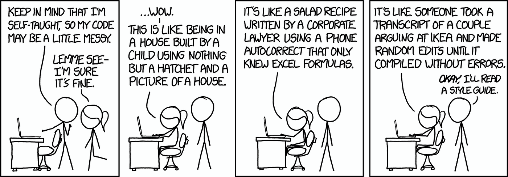

# Introduction
In programming, there is nothing more important than functionality, right? The whole purpose of code is to serve a function, and to be able to create seemingly anything from a collection of 1s and 0s. The idea that there essentially no other things we need to think about in coding..

...is wrong. Unless you still live in the startup era of technology, long gone are the days that we need to make code in any way, shape, or form. Sure, if you are just a starting programmer, there is nothing wrong with coding in any way that makes sense to you. Putting unlimited nested if-statements will get the program to work, same as letting your strings trail to the ends of your page. This to me is the beauty of coding; there are unlimited ways to answer a problem, and while the overall function is generally the same, the way that it is presented can be very different between two people.
 
It is almost as if there are many dialects to the various languages. Some more understandable than others, but all following a general structure that is understandable to someone. This creates hundreds if not thousands of differences and variations that can be made to code. These differences, however, can make it very difficult to understand to other programmers and developers, and projects with teams of 30+ can be extremly difficult to work together, almost like a language barrier. This is why coding standards are put into place. 

# What is a coding standard
Coding standards are a very common standard in coding. In nearly every language, dating as far back as the C language at least, has a coding standard. They are a set of rules within a language that help legibility and create an organaztion structure that is universal. The correct standard to use is highly debated through nearly every language, and it merely comes down to preference. With this, it has people asking the point of trying to universalize one standard. Regardless of which standard to use, it is agreeable that standards are useful. 

To programmers, it can seem very tedious, as there are many minor details to follow. It may be as small as the type of quote to use, or the amount of spaces before a line. All of these, however, create a uniform look to code, and makes it easy for others to understand and analyze code. This is especially useful in widescale projects, where access and revision of code may go through many different people as well as teams. In this setting, taking extra time to understand the code given is ultimately time lost and money wasted. So even though it takes longer for the developer to code, it relieves the burden for the hundreds of others who may also be editing this code.

For typescript, I have been able to expreience using ESLint to check code against a coding standard. I believe that it is very straightforward, and it definitely helps the readability of the final product. Having it show the errors live, however, makes it very difficuly to focus on the function of the code. Seeing the red lines over nearly all of the code before it is fully written makes it difficuly to read, and it puts the focus on fixing the structure rather than the function. I believe that it would be much better to write the entire code first and then check with ESLint. It can be a great tool used to make code more understandable, but it should not be the sole priority or purpose when making the code. 

# Conclusion
No one is saying to code a certain way. Ultimately your style and understanding of coding is up to you. If you are a solo developer, then there is nothing wrong with publishing something with non-standard coding. Just look to games like Undertale as examples of worldwide famous games that are very messy to read internally. The gamer has absolutely nothing to worry about, as they will never see what's going on behind the scenes. Any coder, however, has an absolutely terrible time trying to decode what is going on. Seeing as the game never had to be updated, this was never a problem. 

There definitely is, however, benefit to learning a coding standard. The semantic of which one will probably not matter, unless you need to use it in a proffesisonal setting. Using a standard, however, teaches you how to code in a legible way, which is useful for others trying to edit or repurpose the code. It can also teach you how to code in a more efficient way, and cause one to think about coding in an organized order, rather than a jubmled mess. 
