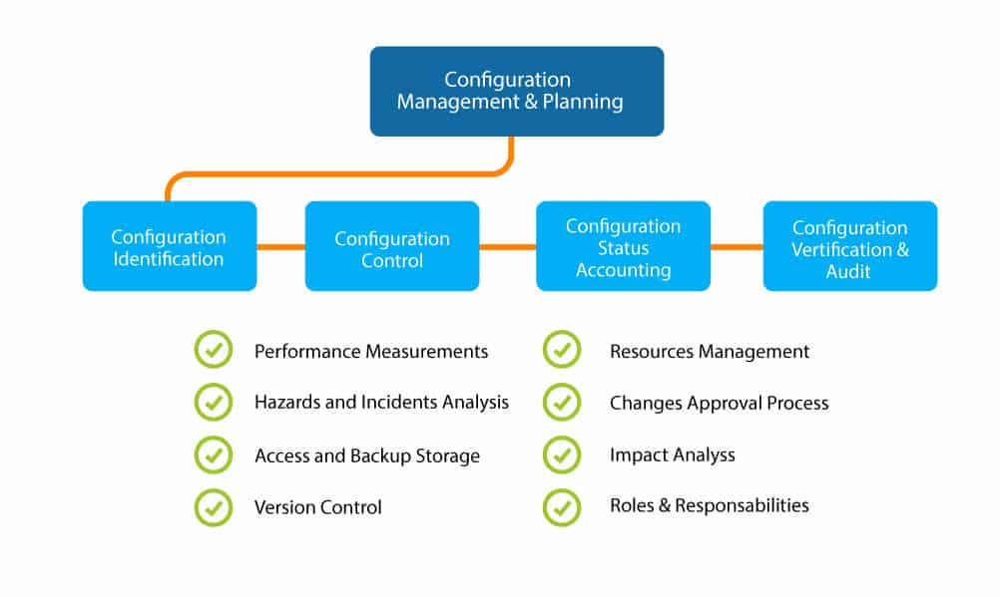
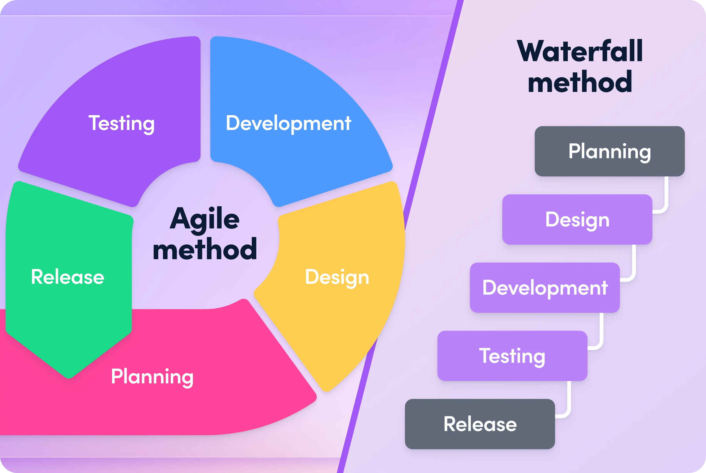

# Background
As a developing computer scientist, one of the core classes that I took towards finishing my degree was a software engineering class. The main focus of the assignments in this class was to learn the necessary skills in order to build and deploy our own website. This included learning languages such as HTML, CSS, and JavaScript, as well as Bootstrap, React, and NextJS for components and organization and PostgreSQL and Vercel for live database and hosting. Despite the focus on website development, this course also taught me a variety of skills related to software development as a whole. Many of the concepts that were taught are valuable to learn, as they teach you how to code more efficiently and in a way that is better suited for customer demand. I would like to highlight some of them here.

# Configuration Management

One of the first concepts that were taught besides creating a professional portfolio (this site!) was to sign up for GitHub. GitHub is very versatile in its ability to hold files as well as comment, access, and modify files. In the class, GitHub was used for nearly every project that included multiple files, and it was a quintessential part of the final project. GitHub does a good job in implementing many of the concepts that are crucial to software development, with configuration management as one of the big ones.

As a general concept, configuration management is the idea that a project should be stored and maintained in a way that is intuitive in allowing continuous development and collaboration across different users. This is very useful when you consider that big coding projects are worked on by many different developers, all on different time schedules and with different tasks. And with the site needing to be live, it is essential that the code needs to be running and that any errors can be reverted back to a safe build.

GitHub, which uses the version control software git, is a great way to implement configuration management. It allows users to collaborate on the same project and owners can change access levels for who can collaborate on a project. The main feature of git, however, is the existence of branches and commits. Branches and commits allow for independent editing, so others can work on a build on their own and then all branches can be combined to the main branch. This also allows users to experiment onto branches and scrap ideas that do not work as it was thought up.

I believe that configuration management is essential in collaborative efforts and projects. It is a streamlined way to handle all different versions and ideas without the risk of losing a previous live build. When you can also assign roles and control who has specific access, you can also ensure that everyone can only have permission to modify things that they need to be working on, which significantly reduces error and it keeps users accountable. 

# Agile Project Management

From one of the first things learned to one of the last things learned, agile project management is a concept that was used in abundance during the final project. This was mainly due to the fact that agile project management is for projects that have multiple parts and/or multiple people. For agile project management, the main concept behind it is that projects are split up into smaller and smaller tasks and assigned to each person. This ensures that work is on time and each person can be designated tasks based on fairness as well as skills and proficiency. 

Often, agile project management is done in small cycles, or increments. By using incremental efforts, you can ensure that changes can be made swiftly and often, something that is essential at the speed that technology evolves in the modern day. Another big concept in agile project management is that there is a vision, rather than a goal. By having a vision, or a moving target, this ensures that a program can evolve with time and incorporate ideas that didn't seem plausible at first, or ideas that were conceived in development. Either way, it allows teams to work with development in mind and make goals based on tangible efforts rather than goals that are very unlikely to be accurate.

In my final project for the software engineering class, agile project management was implemented through the delegation of tasks and deliverables that were required. The main project itself was split into 3 big milestones, each with their own set of __basic__ criteria that were meant to show structure in the program. Within each milestone, a list of tasks were delegated amongst the group to ensure fairness and that everyone can get tasks done in time. Overall, it was a good system, however, even with agile project management, it is difficult to estimate time and skill, so problems still occur. 

Overall I believe that agile project management is a great concept to describe a mentality towards software development, however it needs good management and collaboration to make it work. It is all too often that I hear stories from employees of previous technology companies that the agile project management model is filled with estimations and unnecessary jargon to appear as if there is a well-planned and implemented system. While some of them do serve a purpose such as the story point method of estimation which focuses on complexity rather than pure time, it often just passes on the problem of not being able to estimate properly and evolve, which can only be solved through actual collaboration and communication rather than models for estimation and project management. 

# Conclusion
It takes a lot to build something and have it work. Sometimes the best way to understand how to build something is to fail and then understand concepts of why it is done differently. This is exactly the case with this class that I took, as by exploring programs and experiencing real-life constraints, it gives a good foundation as to why many of the concepts within both website development and software engineering exist in the first place. There are just so many concepts that overlap between website development and software engineering as a whole, so it is inevitable to learn one from another. I believe that these concepts will be extremely useful throughout my journey as a computer programmer and it will be concepts that I use for the rest of my career.

This essay used Github Copilot to check for grammar and spelling.
