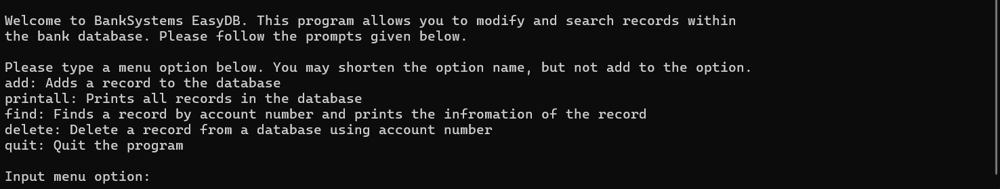

The bank database program was a program designed to showcase a multitude of skills in c and later c++ by creating a fully functional banking database and interactive user interface. The database would a singly linked-list collection of records sorted in order by account number, meaning that each record would point to the next available record sequentially. It was up to the developer (me) to create functionality to add, delete, find, and print all records in the database. In addition, it was also up to me to show text information regarding the system and have users be able to navigate the system through commands as well as input and process information given by the user of the program to be used in the record. Finally, the last goal of the project was to use file I/O to be able to load the information from a file and then reupload the information when the program is completed. In the end, the project had full functionality and met all of the requirements. 

The program itself is very organized as the style used for the class required documentation on all files as well as functions. In addition, in-line comments are used in spaces where the code is a bit complex. A debug mode using command-line arguments and a makefile was also included in order to make project management easier and program debugging easier. The program was also ported to C++ as part of the second project for the class. Nearly all functionality remained the same, with the database portion being moved to a class that stores the head of the list as an instance variable. Debug mode was also switched from command line to pre-processor directives, using defined macros. 

From this experience, I learned how to combine requirements and constraints in order to produce a program very similar to one that would need to be coded for a banking company. It was a showcase of my skills in both C and C++. In addition, I got to combine my knowledge of coding in C as well as my knowledge of Databases and structures in order to write a program that could write to files, store information into a linked list, and manipulate information stored. For the program itself, some improvements that could be made is to add security, through both encryption and a login-password check. While the program has functionality, it lacks in safety and security, which are both essential if this program was actually used in a bank. Overall, the experience was very enjoyable and it taught me a lot about coding and how to approach writing code. 

Link to code: [https://github.com/corveylee/bank_database]
