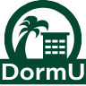

DormU was the final project for my ICS 314: Software Engineering class. The project had us form organizations with other students. From there, we created a name for our organization and brainstormed on some coding projects that would benefit our local UH Manoa community. The project we decided on addressed an issue regarding the dormitories and the connectedness between the resident assistants and the resident in the communities. As I was a former resident advisor, I understood the struggles of trying to get residents to sign up and use confusing programs that do not have much functionality. With that, we aimed to create a program that had easy access to many essential features that residents could use during their time at the dormitories. We also created a contract for working together as well as a project proposal.

[See project proposal](https://docs.google.com/presentation/d/1vgJbArzciW5jrLGX2hNoa8ToWXGg1KQTVep5UJC3eXg/edit?slide=id.p#slide=id.p)

DormU itself was built off of a NextJS template, with sign-up and sign-in capabilities built in. Prisma, Postgres, and Vercel were used together in order to provide a live database that can read and write object relations. There are 2 different roles for resident assistants (Admin) and residents (User). The website itself allows users to see all upcoming events on a calendar as well as allows admins to add events. Admins and users can create their own profile and add their own picture to make them unique. There is also a gallery for residents to post their daily lives and what they are up to. Finally, residents can also chat among their floor and RAs can manage chats in order to provide security and safe use. 

[See the live website](https://dorm-u-app.vercel.app/)

This project taught me the intricacies of professional team work. Much different from a group project, working as an actual organization helped to set goals and work in a way that still provided communication, but also the freedom to work in my own time and pace. The difficulties of this project was definitely the time constraints, as sometimes they were very quick with a lot of stuff to get done. Luckily, the mix of delegating and work paid off and the final product was stable and running. There are definitely more features that we wished we could've added, such as a security system and interface for the RAs to automatically assign residents to rooms, or more visually representative elements that would connect with the database. Overall, this project helped me to be better suited to work in a true professional space. 

[See all updates and more in depth explanations](https://dorm-u.github.io/)

[See the project repository](https://github.com/dorm-u/dorm-u-app)