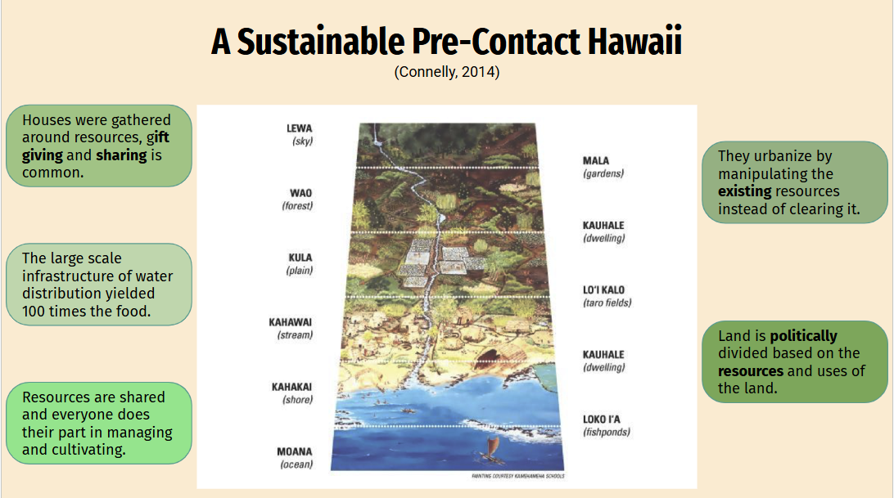

In Hawai'i, modern economy is driven by tourism and business that were established since the overthrow of the Hawaiian monarchy. Many of these economic strategies is neither sustainable nor right to the Hawaiian people. The overthrow of the Hawaiian monarchy itself was a response to more economical rights for Americans rather than the Hawaiian people and monarchy. Even though the US has officially "apologized", things have still not changed. This trend has been a repeated cycle since the introduction of colonial power in Hawaii with the arrival of captain cook in the 1800's. As we have entered the modern era of Hawai'i, these colonial powers are still present and have a significant impact on the economy in Hawaii. 

This slideshow was made for the purpose of education, especially to those who live in or attend education in Hawai'i without understanding the economy that they support. One of the big concepts listed here is the idea of settler responsibility and impacted groups in Hawai'i. This slideshow focuses on the text written by Lauren Ballesteros-Watanabe, founder of Sierra Club of Hawaiʻi and her interview with Rebekah, a white settler of Hawai'i that goes through a journey of self-discovery and her impact as a settler of Hawai'i and what she can do in her position to realize the falsities of the perspective of Hawai'i and to understand the struggles of the indigenous community in Hawai'i.

The other aspect of this slideshow details the need for change and how Hawai'i can begin to move towards a more sustainable society. This includes learning from the sustainable past of Hawai'i before contact, as well as working together with other communities to establish common ground and develop a system that supports everyones' aspirations and goals. Overall, this project aimed to summarize many of the reasons for change in Hawai'i and methods to accomplish that goal.

This project has taught me how to approach culture and native land in the place that I grew up. Growing up in Hawai'i and not being Hawaiian definitely puts a responsibility for me to show respect and to support the people who's land has been taken from them. Especially at a institution for higher education such as UH, this is important for students and peers alike to learn. For my interests and career path, I hope to use technology to showcase this effort of people to educate and bring back Hawai'i to the place it is supposed to be. Overall, it is students, residents, and the people of the world's responsibility to understand and process this history and so very truth of this island.

[See the slideshow](https://docs.google.com/presentation/d/1egsVEhda8T7HYUnEHYKdXDn2m0UfYExNonhRl8gcgMg/edit?usp=sharing)